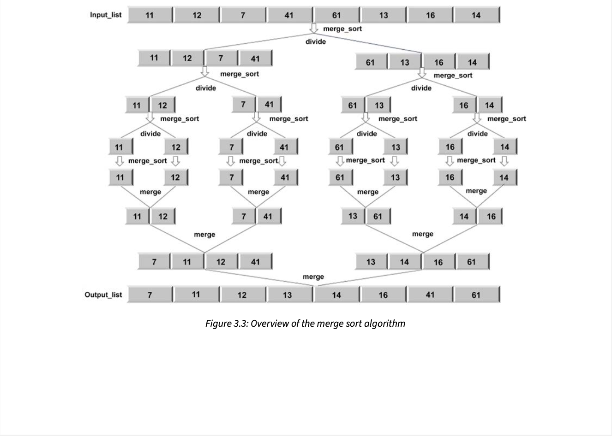

The main algorithmic patterns in computer Science are:
* Recursion

* Dynamic Programming
  
* Divide and Conquer Strategy

* Greedy Approach

---------------------------------
### **Recursion**

A recursive algorithm calls itself repeatedly in order to solve the problem until a certain condition is fulfilled. A recursive function can be in an infinite loop; therefore, it is required that each recursive function adheres to certain properties. At the core of a recursive function are two types of cases:

1. Base cases: These tell the recursion when to terminate, meaning the recursion will be stopped once the base condition is met
2. Recursive cases: The function calls itself recursively, and we progress toward achieving the base criteria.

**In the dynamic approach, we divide a given problem into smaller sub-problems. In recursion also, we divide the problem into sub-problems. However, the difference between recursion and dynamic programming is that similar sub-problems can be solved any number of times, but in dynamic programming, we keep track of previously solved sub-problems**

Two Examples of Recursion:
* Factorial with recursion technique: [factorial calculation using pure recursion](factorialWithRecursion.py)
* Fibonacci Series with recursion technique: [fibonacci series calculation using pure recursion](fibonacciSeriesWithRecursion.py)

If these same problems were to solve using **dynamic programming** then, we would have to make sure that intermediate results are store in some data structure so that we don't end up calculating computations multiple times after it is done the first time.

* Factorial with dynamic programming: [factorial calculation using pure recursion](factorialWithDP.py)
* Fibonacci Series with dynamic programming: [fibonacci series calculation using pure recursion](fibonacciSeriesWithDP.py)

---------------------------------
### **Divide and Conquer**

The divide-and-conquer paradigm divides a problem into smaller sub-problems, and then solves these; finally, it combines the results to obtain a global, optimal solution. More specifically, in divide-and-conquer design, the problem is divided into two smaller sub-problems, with each of them being solved recursively. The partial solutions are merged to obtain a final solution. ***This is a very common problem-solving technique, and is, arguably, the most commonly used approach in algorithm design.***

Some examples of the divide-and-conquer design technique are as follows:
* Merge sort
* Binary search
* Quick sort

**Merge sort**

+ Merge sort is an algorithm for sorting a list of n natural numbers
+ Firstly, the given list of elements is divided iteratively into equal parts until each sublist contains one element
+ Then these sublist are combined to create a new list in a sorted order

Merge Sort Code using Divide and Conquer: [mergeSort](mergeSort.py)

---------------------------------
