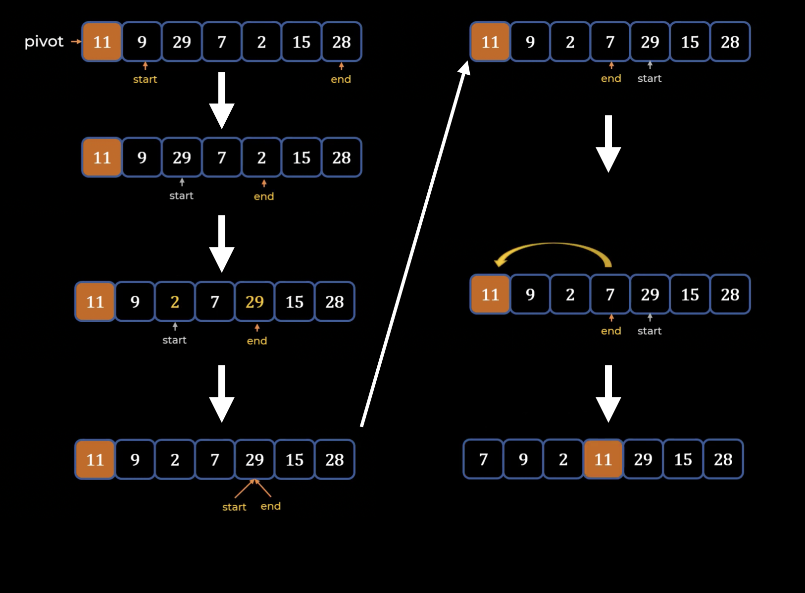
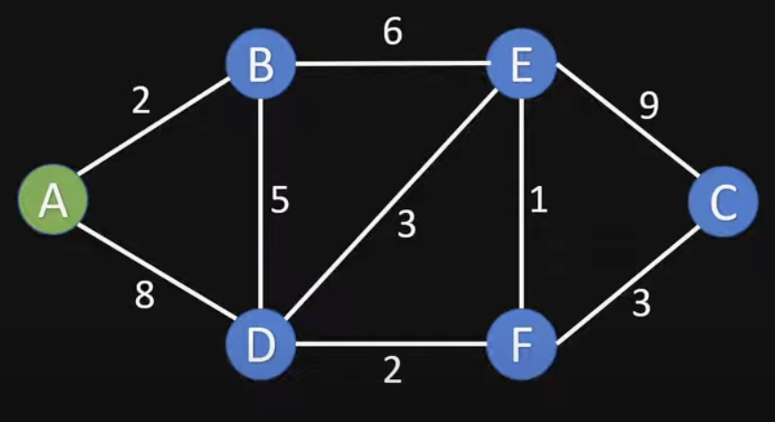
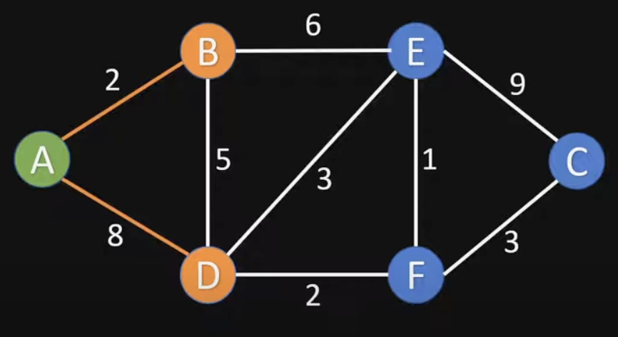
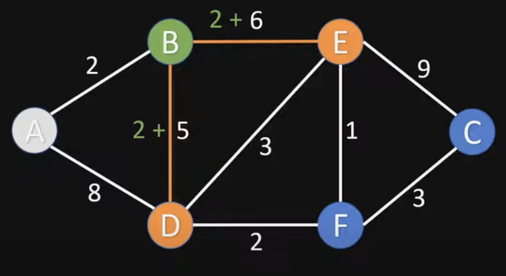
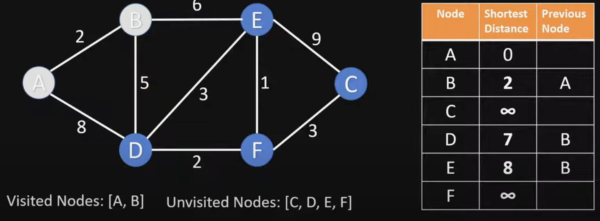
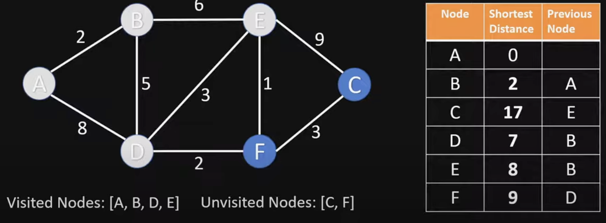
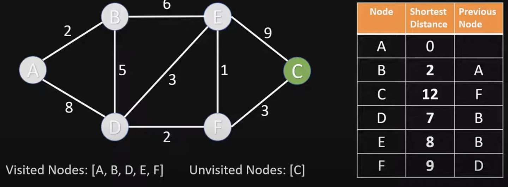
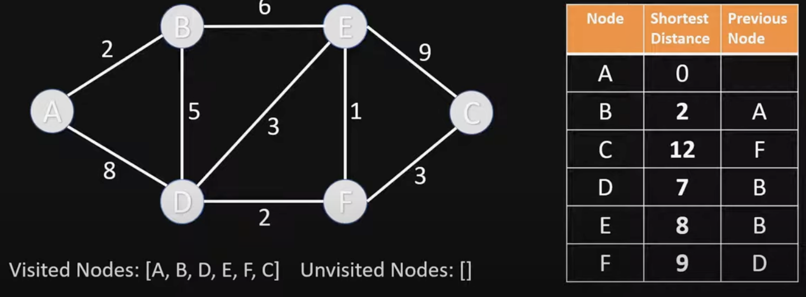

The main algorithmic patterns in computer Science are:
* Recursion

* Dynamic Programming
  
* Divide and Conquer Strategy

* Greedy Approach

---------------------------------
### **Recursion**

A recursive algorithm calls itself repeatedly in order to solve the problem until a certain condition is fulfilled. A recursive function can be in an infinite loop; therefore, it is required that each recursive function adheres to certain properties. At the core of a recursive function are two types of cases:

1. Base cases: These tell the recursion when to terminate, meaning the recursion will be stopped once the base condition is met
2. Recursive cases: The function calls itself recursively, and we progress toward achieving the base criteria.

**In the dynamic approach, we divide a given problem into smaller sub-problems. In recursion also, we divide the problem into sub-problems. However, the difference between recursion and dynamic programming is that similar sub-problems can be solved any number of times, but in dynamic programming, we keep track of previously solved sub-problems**

Two Examples of Recursion:
* Factorial with recursion technique: [factorial calculation using pure recursion](factorialWithRecursion.py)
* Fibonacci Series with recursion technique: [fibonacci series calculation using pure recursion](fibonacciSeriesWithRecursion.py)

If these same problems were to solve using **dynamic programming** then, we would have to make sure that intermediate results are store in some data structure so that we don't end up calculating computations multiple times after it is done the first time.

* Factorial with dynamic programming: [factorial calculation using pure recursion](factorialWithDP.py)
* Fibonacci Series with dynamic programming: [fibonacci series calculation using pure recursion](fibonacciSeriesWithDP.py)

---------------------------------
### **Divide and Conquer**

The divide-and-conquer paradigm divides a problem into smaller sub-problems, and then solves these; finally, it combines the results to obtain a global, optimal solution. More specifically, in divide-and-conquer design, the problem is divided into two smaller sub-problems, with each of them being solved recursively. The partial solutions are merged to obtain a final solution. ***This is a very common problem-solving technique, and is, arguably, the most commonly used approach in algorithm design.***

Some examples of the divide-and-conquer design technique are as follows:
* Merge sort
* Binary search
* Quick sort

\\\\\\\\\\\\\\\\\\\\\\\\\\\\\\\\\\\\\\\\\\\\\\\\\\\\\\\\\\\\\\\\\\\\\\\\\\\\\\\\\\\\\\\\\\\\\\\\\\\

**Merge sort**

+ Merge sort is an algorithm for sorting a list of n natural numbers
+ Firstly, the given list of elements is divided iteratively into equal parts until each sublist contains one element
+ Then these sublist are combined to create a new list in a sorted order

Time Complexity of Merge Sort: **n** ***log(n)***  
Merge Sort Code using Divide and Conquer: [mergeSort in python \[Divide and Conquer technique\] ](mergeSort.py)

\\\\\\\\\\\\\\\\\\\\\\\\\\\\\\\\\\\\\\\\\\\\\\\\\\\\\\\\\\\\\\\\\\\\\\\\\\\\\\\\\\\\\\\\\\\\\\\\\\\
 
**Binary Search**  
The binary search algorithm is based on the divide-and-conquer design technique. 

Time Complexity of Merge Sort: ***log(n)***

Binary Search using two pointers: [binary search using two pointer](binarySearchTwoPointer.py)  
Binary Search using recursion: [binary search using recursion](binarySearchRecursion.py)

\\\\\\\\\\\\\\\\\\\\\\\\\\\\\\\\\\\\\\\\\\\\\\\\\\\\\\\\\\\\\\\\\\\\\\\\\\\\\\\\\\\\\\\\\\\\\\\\\\\
 
**Quick Sort**  

The logic of this sorting is:
1. Find pivot
2. Do partitioning (putting pivot in correct position)
   - left side is all less than or equal to pivot
   - right side is all greater than pivot
3. This creates two partitions & then these two subarrays are recursively quick sorted again

It is in-place sorting algorithm.  

Worst time-complexity: ***n2***  
Best and average time-complexity: **n** ***log(n)***

 
There are two forms of paritions:  
   - Hoare partition scheme [more popular, first element is taken as pivot]  
   - Lomuto partition scheme [less popular, last element is taken as pivot]

*Step 1*: Select the first element as pivot  
*Step 2*: Have start (one after pivot) & end (last of the array).  
*Step 3*: Move start to the ***right*** till you find a element ***greater*** than pivot  
*Step 4*: Move end to the ***left*** till you find a element ***smaller*** than pivot  
*Step 4*: Swap the start and end  
*Step 5*: Continue this until start and end haven't crossed  
*Step 6*: After they have crossed swap pivot element with end  
*Step 7*: Continue this recursively  

Initial steps for getting the first partitioning: [first step Quick Sort](firstStepQuickSort.py)  
Final Quick Sort: [Quick Sort](quickSort.py)

---------------------------------
### **Greedy Algorithm**

***Greedy algorithms often involve optimization and combinatorial problem.***

For example, consider that you are given some random digits, say 1, 4, 2, 6, 9, and 5. Now you  have to make the biggest number by using all the digits without repeating any digit.

Let us consider another example to better understand the greedy approach. Say you have to give  29 Indian rupees to **someone in the minimum number of notes**, giving one note at a time, but  never exceeding the owed amount. Assume that **we have notes in denominations of 1, 2, 5, 10, 20,  and 50**. To solve this using the greedy approach, we will start by handing _1 20's note, 1 5's note nd 1 1's notes._

***In this approach, at each step, we chose the best possible solution and gave the largest available  note.***

_**Assume that, for this example, we have to use the notes of 1, 14, and 25**_. Then, using the  greedy approach, we will pick the 25-rupee note, and then four 1-rupee notes, which makes a  total of 5 notes. _However, this is not the minimum number of notes possible. The better solution  would be to give notes of 14, 14, and 1._ 

**_In greedy algorithms,  the objective is to obtain the optimum solution from many possible solutions in each step. We  try to get the local optimum solution, which may eventually lead us to obtain the global optimum solution. The greedy strategy does not always produce the optimal solution. However, the  sequence of locally optimal solutions generally approximates the globally optimal solution._** 

_From the example of notes of 1, 14, and 25 to get 29 from minimum number of notes_, it is also clear that the greedy approach does not  always give the best solution, but a feasible and simple one. 

Listed here are many popular standard problems where we can use greedy algorithms to obtain  the optimum solution:  

* Dijkstra’s shortest path problem
* Kruskal’s minimum spanning tree 
* The traveling salesperson problem
* The Knapsack problem 

\\\\\\\\\\\\\\\\\\\\\\\\\\\\\\\\\\\\\\\\\\\\\\\\\\\\\\\\\\\\\\\\\\\\\\\\\\\\\\\\\\\\\\\\\\\\\\\\\\\
 
**Shortest path problem using Dijkstra Algorithm**  
Suppose you have a weighted graph with nodes & edges, then Dijkstra algorithm helps to find:

* **_shortest distance from a fixed node to every other node._**
* Eg: Cities are nodes and routes between them are the edges. Dijkstra Algorithm helps to find the shortest path from one city to another.

So let's say this is the graph, and we want to find the shortest distance from A node to every other node, then the steps are:

1) Mark all nodes as unvisited.  
      _Visited Nodes = [ ]; UnVisited Nodes = [A, B, C, D, E, F]_

2) Assign to all nodes except itself a infinity value  

| Node       | Shortest Distance | Previous Node  |
|------------|-----|-------------|
| A   | 0  |    |
| B | infinity  |     |
| C  | infinty  |       |
| D   | infinity  |    |
| E | infinity  |     |
| F  | infinity  |       |

3) For the current node calculate the distance to all the unvisited neighbors.  
_**Update shortest distance if new distance is shorter than old distance.**_

| Node       | Shortest Distance | Previous Node  |
|------------|-----|-------------|
| A   | 0  |    |       |
| B | 2  |  A   |      
| C  | infinty  |       |
| D   | 8  | A   | A |
| E | infinity  |     |
| F  | infinity  |       |

4) Mark current node as visited.  
_Visited Nodes = [A]; UnVisited Nodes = [B, C, D, E, F]_

5) Choose current node from unvisited nodes with minimal distance.  
_So, B is our new node._

After this, the following nodes are visited and the tables are filled successfully.

**After visiting A & B**

**After visiting D**

**After visiting E**

**After visiting F**

**After visiting C**

------------------------

    
<!-- --------------------------------- -->

