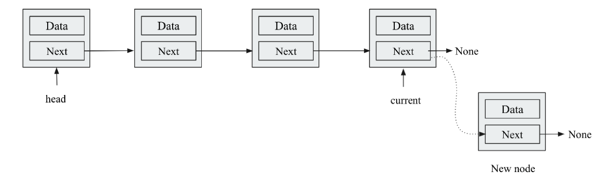

This chapter is on LinkedList.

The topics are:
* Single Linked List
* Double linked list
* Circular linked list

We will see Single linked list first:

* Inserting value at the end (append operation): [Adding item at end Single Linked List](appendItematEnd_SingleLinkedList.py)  
This implementation of adding the element to the end of the list of O(n) because we have to traverse to the end of the list to add an element.

Here is the visualization:

