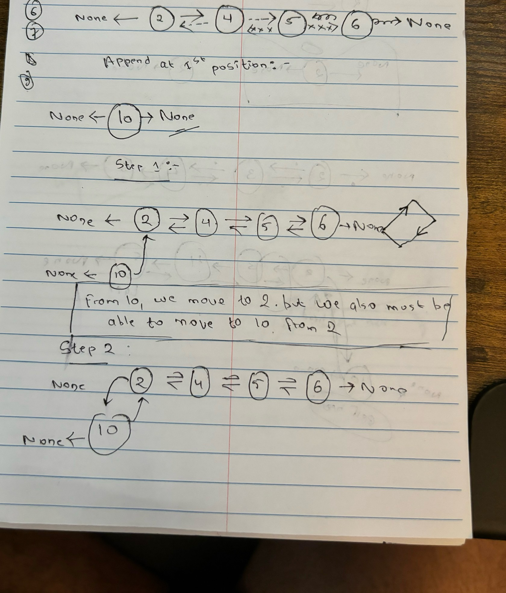

This chapter is on LinkedList.

The topics are:
* Single Linked List
* Double linked list
* Circular linked list
------------------------------------------------------------------------
# Single Linked List:

### Append Operation
1. Inserting value at the end (just using the head)
2. Inserting value at the end (using the tail)
3. Inserting value at the particular index

------------------------------------------------------------------------

1. **Inserting value at the end** (_**append operation - using just the head**_): [Adding item at end Single Linked List](appendItematEnd_SingleLinkedList.py)  
This implementation of adding the element to the end of the list of **O(n)** because we have to traverse to the end of the list to add an element.

Here is the visualization:

2. **Inserting value at the end** (_**append operation - using just the tail**_): [Adding item at end Single Linked List using Tail](appendItematEnd_SingleLinkedList_tail.py)  
This implementation of adding the element to the end of the list of **O(1)** because we just add the element straight to the tail.  
  * if no element is in the linkedList, the head and tail becomes the same
  * **_While adding the element to the tail, the new tail will shift too (to the node just created)._**

3. **Inserting value at the particular index**: [Insert at particuar index](insertAtParticularIndex.py)  
  * Remember that **_temp = curr.next_** will store all the values that comes after curr.next
  

### Deleting Operation 
1. Deleting at the beginning
2. Deleting at the end
3. Deleting any intermediate node
4. Clearing the whole linked list

------------------------------------------------------------------------
1. **Deleting Element at the beginning**: [Delete at the beginning](deleteElementAtBeginning.py)  

2. **Deleting Element at the end**: [Delete at the end](deleteElementAtEnd.py)  

3. **Deleting Element at particular index**: [Delete at particular index](deleteElementAtParticularIndex.py)  

4. **Clearing the whole linkedList**: [Clearing the linked List](clearLinkedList.py)

------------------------------------------------------------------------
# Double Linked List:

### Append Operation
1. Append Item at the beginning of the Double linked list
2. Append Item at the end of the Double linked list
3. Append Item at particular index of the Double linked list

------------------------------------------------------------------------
1. **Append Item at the beginning of the Double linked list**: [Adding item at start Double Linked List](appendItematStart_DoubleLinkedList.py)  
    

2. **Append Item at the end of the Double linked list**: [Adding item at end Double Linked List](appendItematEnd_DoubleLinkedList.py)  
3. **Append Item at particular index of the Double linked list**: [Adding item at particular index Double Linked List](appendItematParticular_DoubleLinkedList.py)  
